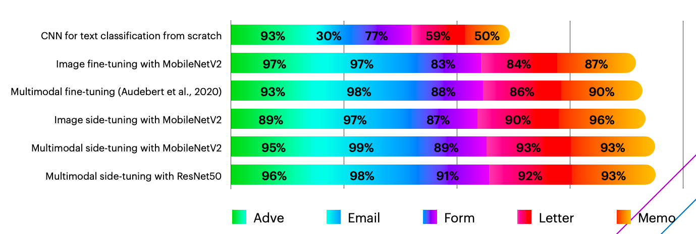

# Multimodal `Side-tuning`

<div>
  
</div>

In this repository we provide implementation of side-tuning framework using multimodal input features. 
The side-tuning framework was originally proposed in the paper [Side-Tuning: Network Adaptation via Additive Side Networks](https://arxiv.org/abs/1912.13503).

## Multimodal Side-Tuning for Document Classification

In this work, we propose to combine different methodologies to automatically and efficiently infer the type of a document given its image. 
The framework exploits heterogeneous inputs, since we train end-to-end both from images and text. 
It takes advantage of lightweight off-the-shelf deep architectures, such as *MobileNet* and *ResNet* and implement learning via network adaptation, using a novel approach called *Side-Tuning*, originally proposed by Zhang and colleagues from Berkeley.

### Datasets


In order to assess the quality of the proposed methodology, we selected a benchmarking dataset for the document image classification task. 
The dataset comprise 400 000 grayscale images of documents divided into 16 categories and is a subset of the *Legacy Tobacco Document Library*. 
We validated the hyper-parameters for the model to be trained on this dataset on a small subset already present in the literature, named **Tobacco3482**.

### Multimodal Side-Tuning


Network adaptation immediately seemed to be the way to approach the multimodal problem and thus we selected a state-of-the-art framework that, in our understanding, could have helped exploiting the data nature heterogeneity.
In side-tuning, one side of the network (left, in the figure) has locked weights while the unlocked part on the right, allows network’s parameters update. Notably, side-tuning offers a way to combine the input features by applying a linear transformation, which coefficients have to be properly selected. 
Side-tuning features combination presents two peculiar values for the blending parameter alpha. alpha equal to 0, that corresponds to fine-tuning in transfer learning fashion and alpha equal to 1, that permits to perform features extraction.


In the multimodal setting, we selected one off-the-shelf architecture pre-trained on imagenet for image classification, and one CNN for text classification. 
We chose the side network, the one with locked weights, to be the same as the one for the image classification task, in order to favor visual features over textual. 
We then merge the outputs by linearly combining the features resulting from each network and finally, we added a fully connected layer before the actual classifier. Details concerning the ablation study that led to this configuration can be found in the paper.

### Alpha curriculum

What emerged from the work is the confirmation of the initial hypothesis that side-tuning would have allowed us to explore the space of possible combinations offered by the multimodal inputs. 
In particular, when considering the document image classification task, we found that the best cluster of models benefits from learning textual features while extracting visual. 
In other words, these models place themselves between the yellow and the green area.


### Results

Experimental results were conducted on the one hand to assess the relevance of multimodality and that of side-tuning, while, on the other hand, to compare with the already existing models and proving the effectiveness of our methodology. 
In conclusion, both the claims proved to be correct.




To conclude and highlight one of its most significant aspects, we would like first to thank the reviewers and, in general, the conference committee of ICPR2020, that stressed on the importance of a deeper analysis of our framework, helping us to have better insights of our own work. 
Our model was able not only to achieve performances on-par with those at the state of the art on the large dataset, but was able to achieve it using lightweight architectures. 
This allows not only to decrease the carbon footprint, an aspect that nowadays is gaining a deserved momentum, but it permits to run the inference procedure almost in real-time.

## Contents 
- [Quickstart](#quickstart-)
- [Running experiments](#running-experiments-)
- [Citation](#citation-)
- [References](#references-)

## Quickstart [\[^\]](#Contents)

The proposed implementation depends on `Python3.6+` and uses the `PyTorch` deep-learning framework, a list of used packages along with their version can be found in the [requirements.txt](requirements.txt). Simpy install it via:

```sh
pip install -r requirements.txt
```

However, some specification should be made:

1. the `FastText` package has been compiled [from the source repository](https://github.com/facebookresearch/fastText) and not installed from `PyPI`.

Download the Tobacco3482 dataset to test the demo or try with the RVL-CDIP full dataset.

## Running experiments [\[^\]](#Contents)

The repository comes with a demo that can be found in `src` folder with the name `demo_mmst.py`. It can be configure with the preferred hyperparamters and run with the following command.

```bash
python3 demo_mmst.py
```

For space reason, the datasets are not included in the repository. Reference for the download can be found on the [Quicksign github page](https://github.com/Quicksign/ocrized-text-dataset). The authors of this work do not held responsible for the availability of the datasets.

## Citation [\[^\]](#Contents)

If you find this repository useful, please cite the original paper work:

```bibtex
@inproceedings{Zingaro2020,
    title={Multimodal Side-Tuning for Document Classification},
    author={Stefano P. Zingaro and Giuseppe Lisanti and Maurizio Gabbrielli},
    year={2020},
}
```

## References [\[^\]](#Contents)
 
- J. O. Zhang, A. Sax, A. Zamir, L. Guibas, and J. Malik, “Side-Tuning: Network Adaptation via Additive Side Networks,” 2019.
- N. Audebert, C. Herold, K. Slimani, and C. Vidal, “Multimodal deep networks for text and image-based document classification,” Jul. 2019.
- M. Z. Afzal, A. Kolsch, S. Ahmed, and M. Liwicki, “Cutting the Error by Half: Investigation of Very Deep CNN and Advanced Training Strategies for Document Image Classification,” Proc. Int. Conf. Doc. Anal. Recognition, ICDAR, vol. 1, pp. 883–888, 2018.
- A. W. Harley, A. Ufkes, and K. G. Derpanis, “Evaluation of deep convolutional nets for document image classification and retrieval,” Proc. Int. Conf. Doc. Anal. Recognition, ICDAR, vol. 2015-November, pp. 991–995, 2015.
